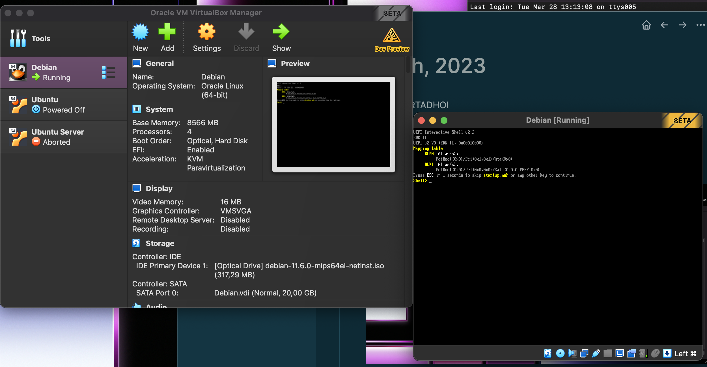
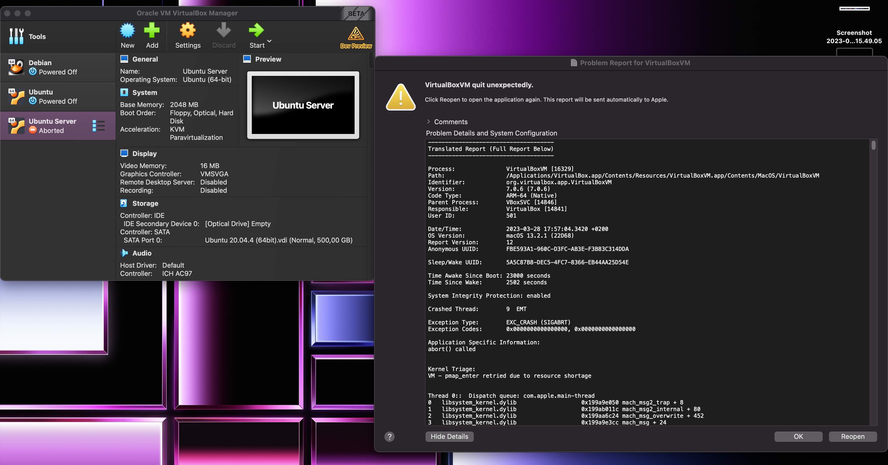
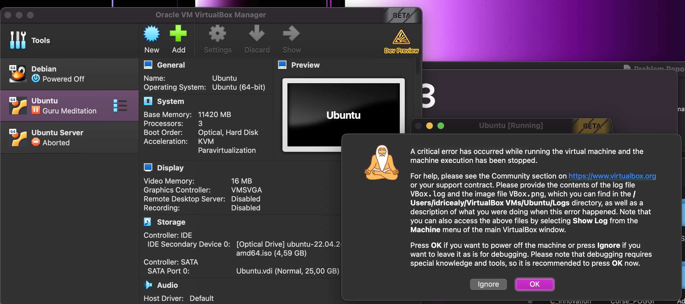

- Idricealy MOURTADHOI
- Ordinarteur M1 Pro
- J'ai donc tenté d''installer 3 VM sur Virtual Box et j'ai :
	- Debian, la VM lance un CMD qui ne reconnais pas les CMD Bash.
	- 
	- Si pas d'image => debian.png
	- Ubuntu Server, crash de la VM :
	- 
	- Si pas d'image => server.png
	- Ubuntu 22.04, d'abord un prompt qui s'affiche dans le vide pendant 30 secondes et ensuite crash de la VM :
	- 
	- Si pas d'image => ubuntu22-04.png
	-