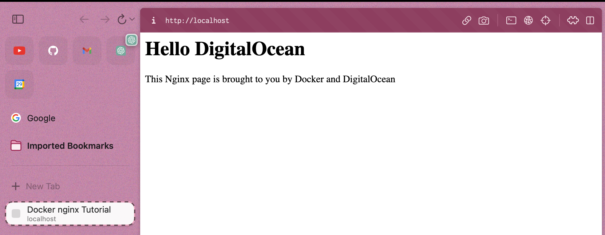

- docker pull nginx
- docker run --name docker-nginx -p 80:80 -d nginx
- docker stop docker-nginx
- Création d'une page HTML pour la faire hébegrer sur un server nginix :
	- mkdir -p ~/docker-nginx/html
	- cd ~/docker-nginx/html
	- nano index.html => un peu de code blabla à l'intérieur
	- docker run --name docker-nginx -p 80:80 -d -v ~/docker-nginx/html:/usr/share/nginx/html nginx => cette commande va nous permettre de créer un lien entre le dossier de base ou se trouve les page HTML de ngnix et notre dossier avec notre page HTML créer précdemment
	- 
- Dans cette deuxième étape je vais essayer de faire la même chose mais en utlisant un Alpine, Ngnix et un Dockerfile (pas terminé).
-
- Vacataire Software Engineer (Devops) Malo Girard, Jelly Smack :
	- Plan => Jira Software avec le product Manager/Owner, outil comme Trello
	- Notion de langage Gherkin
	- Dev conteneur avec VS CODE
	- Trunk Base vs GitFlow
	- Gitcommit vs Convetional commit :
		- Point d'excla break in changes par exemple gros changements donc difficile pour revenir en arriere
		- Sémantique release : pour gérer les numéro de version
	- Pour le build :
		- Amazon ECR pour stocker les ISO
		- Argo : pour mettre a jour les ISO qu'on été mis dans AmazonECR et les mettre dans kubernetes
		- Kubernetes : Pour adapter les images
	- Lint, gitlab
	- Environnement ephémère vs environnement pré-prod
	- Teraform => Langage pour communiquer avec les différentes services cloud de Amazon
	- Deploy : Route versioning investigation
	- Dead technique
	- Operate => Hotfix
	- Monitor => Amazon CloudWatch et DataDog
	- Notion