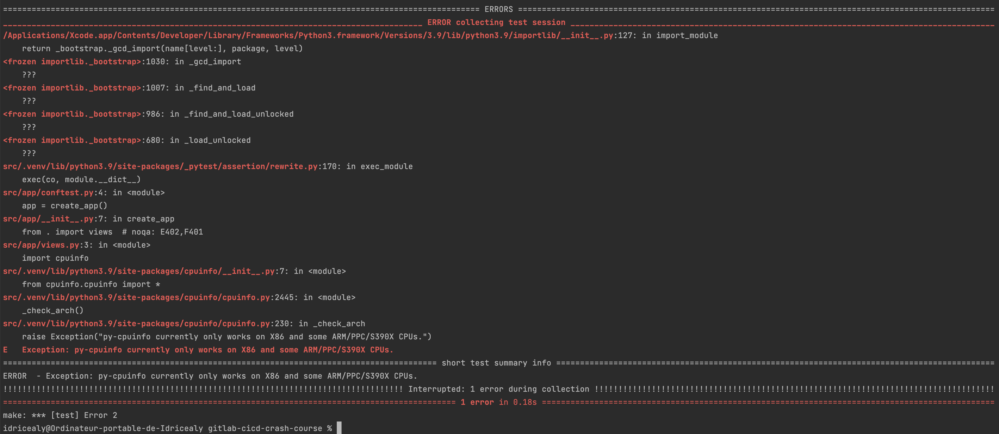

- {{video https://youtu.be/qP8kir2GUgo}}
	- {{youtube-timestamp 40}} Le but est de comprendre les fondamentaux du déploiement continue et de l'intégration continue avec une application Python. 4 étapes :
		- Les test unitaires
		- Le build de l'image Docker
		- Mettre l'image dans un contenaire privée
		- Et le déployer sur un server ubuntu distant
	- 
	-
	- {{youtube-timestamp 101}}  Roadmap du DevOps complet avec gitlab
	- {{youtube-timestamp 154}} Dès qu'on va commit des changements on va déclencher la pipeline qui va tout faire automatiquement
	- {{youtube-timestamp 574}} ' $ make test ' => pour run les test
		- 
		- Erreur lors du make test, problème d'import de certaines librairies du à la version du python, surement du au fait que j'utilise un processeur M1. La même issue a été reporté par un gars sur youtube en commentaire.
	- {{youtube-timestamp 802}}  la pipeline doit être crée via un fichier yml :
		- On défini ce qu'on appel des " jobs " afin de définir les taches à executer => les runners de gitlab execute les taches automatiquement
		- On peux faire executer ces taches dans un conteneur docker qui sera lui sur un machine Linux/Windows sur un gitlab runner
		- {{youtube-timestamp 1137}} On peux spécifié par "Jobs" quel docker image executer
		- {{youtube-timestamp 1282}} before_script, permet d'installer par exemple des dépendance avant d'executer notre tache.
		- {{youtube-timestamp 1490}}  On a le retour de la tache effectué, utile pour debugger dans le cas ou ça fonctionne pas
		- {{youtube-timestamp 2107}} On crée l'image docker et on l'a push dans notre repo privée grâce à une authentification login/password
		- {{youtube-timestamp 2415}}  Docker dans Docker => on build notre image docker grâce à Docker
			- {{youtube-timestamp 2496}}  => Notre client docker va nous permettre de faire executer tout les scripts
		- {{youtube-timestamp 2716}} => Stages nous permet de regrouper différentes "jobs" afin de les faire executer dans un sens défini
		- {{youtube-timestamp 3668}} => le deploy nous permet dans un premier temps de linker notre server avec gitlab afin de lui faire pointer notre image docker contenant notre application. Grâce à l'authentification sur notre repo docker, le server va pouvoir fetch cette image afin de rendre notre application visible sur l'IP.
			- {{youtube-timestamp 3704}} IMPORTANT de d'abord stop le server avant de le run pourquoi ?
				- Au premier deploiement tout va se passer correctement, mais après ça, une fois qu'on va vouloir re-deployer, si on stop pas le serveur, on va vouloir re-deployer sur un port qui est deja en action donc on aura un fail.
	-
	- Jest => Test unitaire en JS
	-